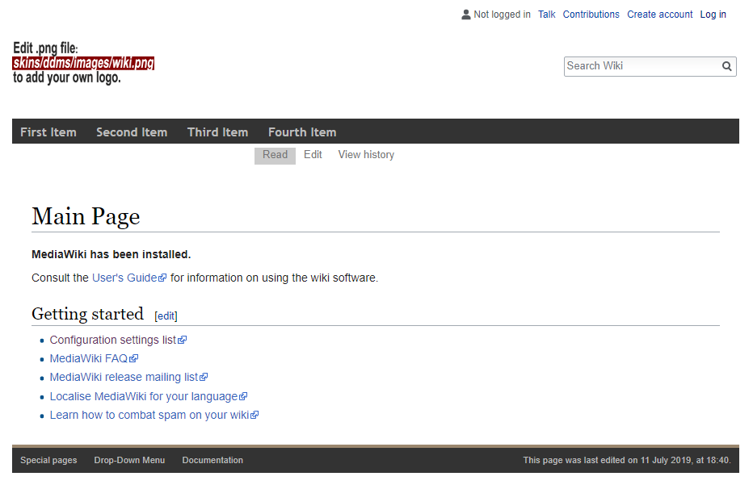
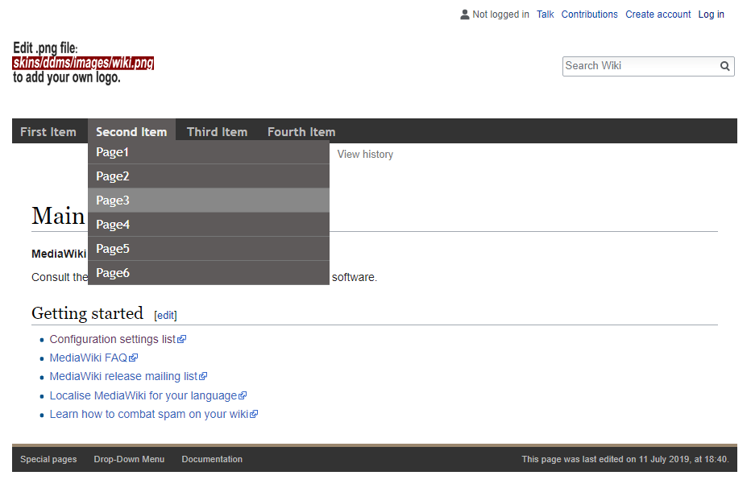

# Drop Down Menu Skin

## Description
A re-creation of the GuMaxDD 1.2 skin for MediaWiki 1.32+. Based on the default Vector skin included in MediaWiki 1.32.2.

## Installation
1. Download ddms skin

2. Place the ddms files in a new folder called "ddms" under "skins".

3. OPTIONAL: Set default skin in Preferences.

NOTE: Edit the MediaWiki:sidebar page to make changes to the drop-down menu.
